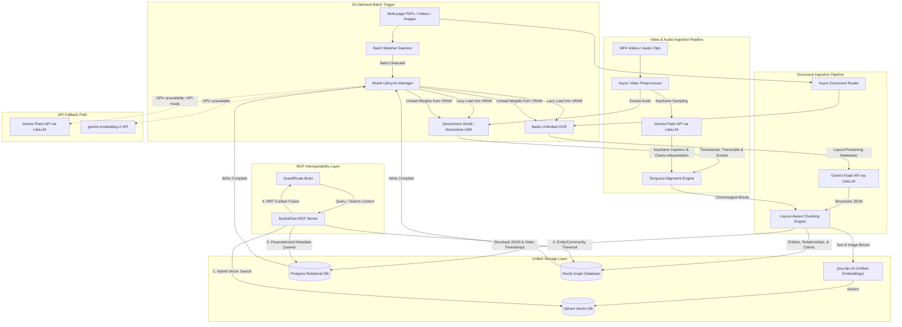

# SyntraFlow: Multi-Agent Document Extraction & Synthesis Engine

An enterprise-grade ingestion and retrieval engine designed to ingest continuous streams of unstructured multi-modal assets (text documents, invoices, images, audio, and videos), perform high-accuracy layout and content extraction, clean and chunk inputs, and index them into a hybrid vector-relational architecture. SyntraFlow exposes its capabilities via the Model Context Protocol (MCP) to provide high-retrieval context mapping to cognitive decision agents (such as GuardRoute). It is optimized to run locally, loading its extraction models on-demand only during ingestion cycles to preserve system resources.

---

### Tech Stack

| Component | Tool / Framework | Version / Context | Rationale |
| :--- | :--- | :--- | :--- |
| **Orchestration** | LangGraph & LangChain | Python SDK | Manage state-machines, conditional routing, and agent loops. |
| **Secure Interoperability**| Model Context Protocol (MCP) | SDK / Custom Servers | Exposes standard tools for document retrieval and SQL queries to GuardRoute. |
| **Vector Database** | Qdrant | Self-hosted Docker / Cloud | Fast semantic search, payload support, and high-performance hybrid filtering for Vector RAG. |
| **Graph Database** | **Neo4j** | 5.20+ | Handles entity-relation extraction graphs, hierarchy nodes, and community summaries for GraphRAG. |
| **Relational Database** | PostgreSQL | 16+ | Handles structured extraction payloads, video timestamps, and metadata. |
| **OCR & Layout Parser** | **Baidu Unlimited-OCR** / **Gemini Flash API** | Local model / External API | **Customizable OCR**: Supports local layout parsing (Baidu OCR, ~4-6 GB VRAM) OR external API pass (Gemini Flash layout-aware OCR via LiteLLM) to run completely zero-VRAM locally. Configured via `OCR_PROVIDER` in `.env`. |
| **Structured Extraction & Reasoning** | **Gemini Flash API** | Google AI / LiteLLM | Google Gemini API (via LiteLLM) handles structured JSON extraction, GraphRAG entity-relation extraction, and multimodal visual reasoning (charts, video frames, visual QA). |
| **Unified Multimodal Embeddings** | **jina-clip-v2** | Hugging Face Hub (`jinaai/jina-clip-v2`) | Unified text + image embedding model mapping both modalities into a single shared vector space. Supports Matryoshka dimensions (64–1024) and 89 languages. ~1 GB VRAM. |
| **Audio Processing (ASR)** | **SenseVoice-Small** / **Moonshine** | Alibaba / Useful Sensors | **SenseVoice-Small**: Non-autoregressive, 15x faster than Whisper-Large, native emotion and audio event tags, extremely lightweight (~250MB, ~0.25 GB VRAM). **Moonshine** (27M/61M params): Secondary option for ultra-low latency real-time streaming interfaces. |
| **API Fallback (Embeddings)** | **gemini-embedding-2** | Google AI / LiteLLM | Provides natively multimodal embeddings (text, image, video, audio) via API when local GPU is unavailable. Free-tier available. |
| **Preprocessing & ETL** | **asyncio** + `concurrent.futures` + Pandas | Python native | Lightweight async fan-out for document/video preprocessing. No JVM overhead (replaces PySpark for single-machine workloads). |
| **Fine-Tuning Engine** | **Unsloth** via Google Colab | Free T4 GPU Tier | Memory-optimized fine-tuning (2-5x faster, 80% less memory) for local model adapters. |
| **Experiment Tracker** | MLflow | 2.10+ | Centralized tracking of hyperparameters, training runs, and weights. |
| **Voice Streaming** | WebRTC + OpenAI Realtime API | Python WebRTC client | Ultra-low latency voice/multimodal interactions (Whisper + TTS). |

#### Model Consolidated Comparison

> **Before (6 models, ~24-30 GB peak VRAM):**
> Baidu Unlimited-OCR + Qwen2-7B-Instruct + Whisper-large-v3 + ImageBind + SigLIP + jina-embeddings-v3
>
> **After (Optimized Stack, ~6-8 GB VRAM total):**
>
> - **OCR & Layout**: **Baidu Unlimited-OCR** (~4-6 GB VRAM) — kept for superior long-context document parsing.
> - **Extraction & Visual Reasoning**: **Gemini Flash API** — offloaded to API, reducing local VRAM load by ~20 GB.
> - **Multimodal Embeddings**: **jina-clip-v2** (~1 GB VRAM) — unified text-image embedding model.
> - **ASR (Audio)**: **SenseVoice-Small** (~0.25 GB VRAM) — non-autoregressive, 15x faster than Whisper-Large, 6x smaller.

---

### System Architecture & Data Flows

---

### Key Workflows & Processes

#### 1. Customizable Document Ingestion (Baidu OCR vs. Gemini API)
Depending on the `OCR_PROVIDER` configuration in the environment:
- **Local Mode (`OCR_PROVIDER=local`)**:
  1. The `Model Lifecycle Manager` loads `Baidu Unlimited-OCR` weights (~4-6 GB VRAM) into VRAM on the inference server.
  2. Baidu Unlimited-OCR parses layouts, cells, tables, and text from multi-page PDFs (up to 40+ pages) in a single pass, outputting clean, layout-preserving Markdown templates.
  3. The parsed Markdown is sent via LiteLLM to the **Gemini Flash API** with the target schema to produce a structured JSON payload.
  4. Once written, Baidu OCR is deleted from VRAM.
- **API Mode (`OCR_PROVIDER=api`)**:
  1. No local weights are loaded into VRAM, running at zero-VRAM locally.
  2. The document is sent directly to the **Gemini Flash API** via LiteLLM. Gemini parses both the text layout and extracts the target structured JSON schema in a single visual API pass.

#### 2. Video and Audio Ingestion Workflow
1. **Splitting Modalities**: Videos (e.g. `.mp4`) are split into audio tracks and keyframe sequences using native python threads.
2. **High-Speed Transcription (ASR)**: The audio track is run through Alibaba's **SenseVoice-Small** (non-autoregressive, ~250MB size). SenseVoice processes audio 15x faster than Whisper-Large, generating structured text transcripts with emotion metrics and audio event detection tags (laughter, applause, crying).
3. **Keyframe Visual Interpretation via API**: Keyframes are sampled via scene change metrics and sent directly to the **Gemini Flash API** via LiteLLM to generate visual summaries.
4. **Temporal Alignment**: SyntraFlow aligns SenseVoice transcripts and audio events with Gemini's visual summaries and stores chronological segments in Postgres.
5. **Unified Embedding**: Both text blocks and keyframe images are embedded into the same vector space using **jina-clip-v2**, then stored in Qdrant.

#### 3. Knowledge Graph + Vector Hybrid RAG (SOTA Enterprise Search)
SyntraFlow provides a multi-faceted search system supporting Vector RAG, GraphRAG, and Hybrid RAG:
1. **Graph Populating**:
   - During chunking, an LLM pass analyzes text blocks to extract **Entities** (people, places, products, dates), **Relationships** (e.g., "Vendor-A *invoiced* Client-B"), and **Claims** (factual statements).
   - This extracted graph is written to **Neo4j** as nodes and edges.
2. **Multi-Faceted Search Options**:
   - **Vector RAG**: Performs standard cosine similarity search in Qdrant using `jina-clip-v2` embeddings, returning top-k text/image blocks. Optimized for specific semantic lookup.
   - **GraphRAG**: Traverses Neo4j nodes matching query entities, extracting relationship subgraphs, parent entities, and pre-computed community summaries. Optimized for global summarization and relational reasoning.
   - **Hybrid RAG (Default)**: Executes both searches, then uses Reciprocal Rank Fusion (RRF) to merge and rank results. Provides SOTA synthesis by combining semantic vectors with structured factual networks.

#### 4. Model Context Protocol (MCP) Endpoint Schema
SyntraFlow exposes a standard MCP Server interface, queryable as a tool:
*   `retrieve_documents(query: str, strategy: str = "hybrid", limit: int)`: Performs retrieval in Qdrant and/or Neo4j using the specified strategy (`vector`, `graph`, or `hybrid`).
*   `retrieve_video_segments(query: str, limit: int)`: Locates timestamp ranges where visual descriptions or spoken phrases match.
*   `query_database(table: str, filters: dict, columns: list[str])`: Parameterized query executor against Postgres schemas (rejects raw SQL strings).
*   `query_graph(cypher_query: str)`: Provides read-only Cypher query execution against Neo4j (parameterized filters only to protect graph indices).

---

#### 5. Production Scale-Out (Kafka & Kubernetes)

To handle massive document indexing batches without API server starvation, SyntraFlow scale-out is structured as follows:
1. **Event-Driven Ingestion (Kafka)**:
   - When a user uploads documents or videos, the API gateway immediately registers the files and writes ingestion job items to the Kafka topic `syntraflow-ingestion-jobs`.
   - A cluster of **SyntraFlow Ingestion Workers** consumes tasks from the topic. This decouples file transfer from model indexing, allowing workers to throttle pipeline steps based on local GPU server loads.
2. **Kubernetes Orchestration**:
   - **Ingestion Workers**: Running as simple `Deployment` pods, they are configured to scale horizontally based on the consumer lag of the `syntraflow-ingestion-jobs` topic.
   - **Model Inference Server**: Deployed as a dedicated service bound to GPU-enabled K8s nodes (via node taints/tolerations). Autoscale triggers are based on GPU utilization.
   - **Stateful Storage**: Qdrant, Neo4j, and PostgreSQL are deployed as `StatefulSets` using Persistent Volume Claims (PVC) to guarantee data persistency across container restarts.
